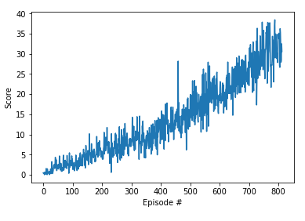

# Introduction
The goal of this project to research the unique challenges faced in a continuos control environment and to implement a double-jointed arm agent to maintain its position at the target location for as many time steps as possible. 
The environment in this case is the [Reacher](https://github.com/Unity-Technologies/ml-agents/blob/master/docs/Learning-Environment-Examples.md#reacher) environment. The observation space for this environment consists of 33 variables corresponding to position, rotation, velocity, and angular velocities of the arm. Each action is a vector with four numbers, corresponding to torque applicable to two joints.
The task is episodic and the environment is considered solved if the agent can maintain an average score of +30 over 100 consecutive episodes.

# Learning Algorithm
I implemented Deep Deterministic Policy Gradient (DDPG) algorithms from the [DDPG paper](https://arxiv.org/abs/1509.02971). This algorithms combine the actor-critic approach with insights form the recent success of Deep Q Network (DQN). The result is a model-free algorithm based on the deterministic policy gradient that can operate over continuos action spaces.

# Model Architecture
The neural network is implemented in class QNetwork. The neural network maps state to action values. The network has three fully-connected layers and a Relu activation function for all hidden layers.The low-dimensional networks had 2 hidden layers with 400 and 300 units respectively (≈ 130,000 parameters).

# Hyperparameter

The agent is implemented in class Agent. The replay buffer (memory)contains collections of experience tuples. In the network, I implement the Fixed Q-Targets as qnetwork_target. I define various hyperparameter. These hyperparameters are suggested for a DDPG in the original paper in the supplementary section (`Page 11`).

* BUFFER_SIZE (`1e6`) - specifies the size of our replay buffer, a change in this value affect the number of experience tuple held at any time to learn from.
* BATCH_SIZE (`126`) - the mini-batch size of the training sample. 
* GAMMA (`0.99`) - discount factor for collected reward.
* TAU (`1e-3`) - for the soft update of target parameters.
* LR_ACTOR (`1e-3`) - learning rate for actor network.
* LR_CRITIC (`1e-3`) - learning rate for critic network.
* UPDATE_EVERY (`20`) - how often we learn from memory (repay buffer).
* LEARN_NUM  (`10`) - number of learning passes.
* EPSILON (`1.0`) - epsilon in the noise process (act step).
* EPSILON_DECAY(`1e-6`) - decay epsilon every update step.
* Ornstein-Uhlenbeck noise parameters
    * OU_SIGMA (`0.15`)
    * OU_THETA (`0.05`) 

# Plot of Rewards
The agent solves the environment at about 813 episodes. The average reward score at the state is over 30. A plot of the average reward for the is training period can be seen below.

# Ideas for future work
* Further might improve on the average score of the agent as indicated by the continuos steep climb of the. It is evident the agent has not achieved and optimal policy.
* This algorithms was implemented for a single agent. Future work could include extending the algorithm (using PPO, D4PG) to account for multiple agents. 